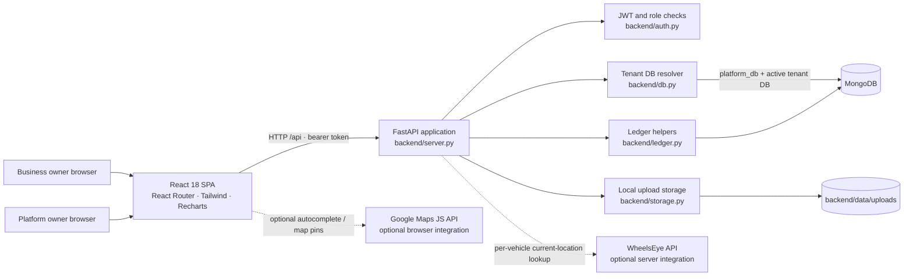
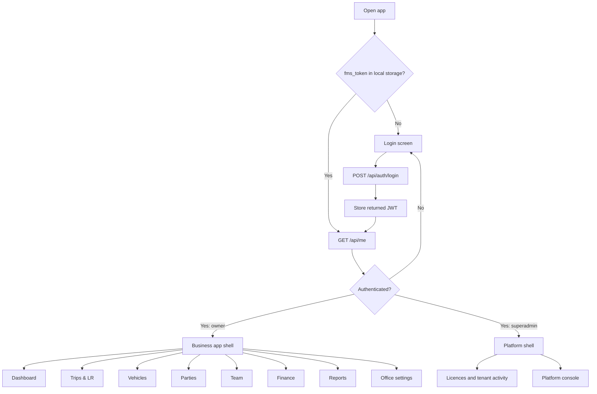
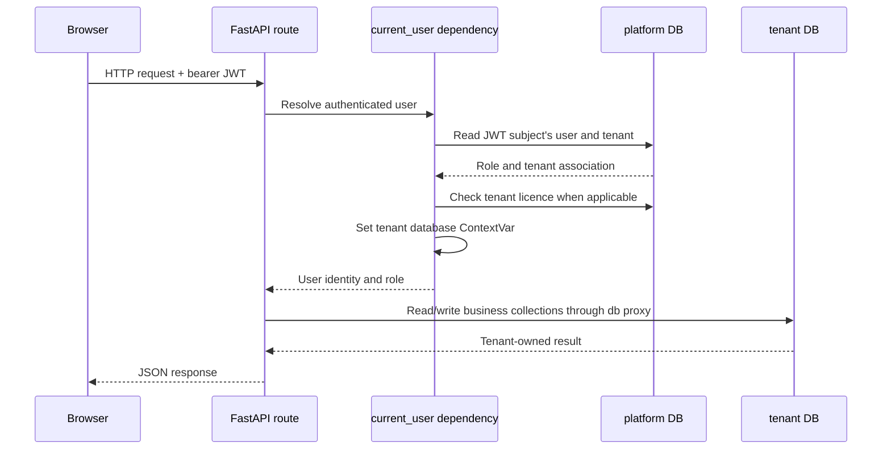
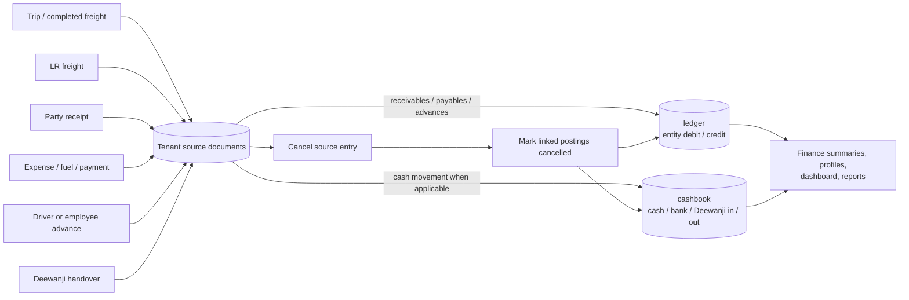
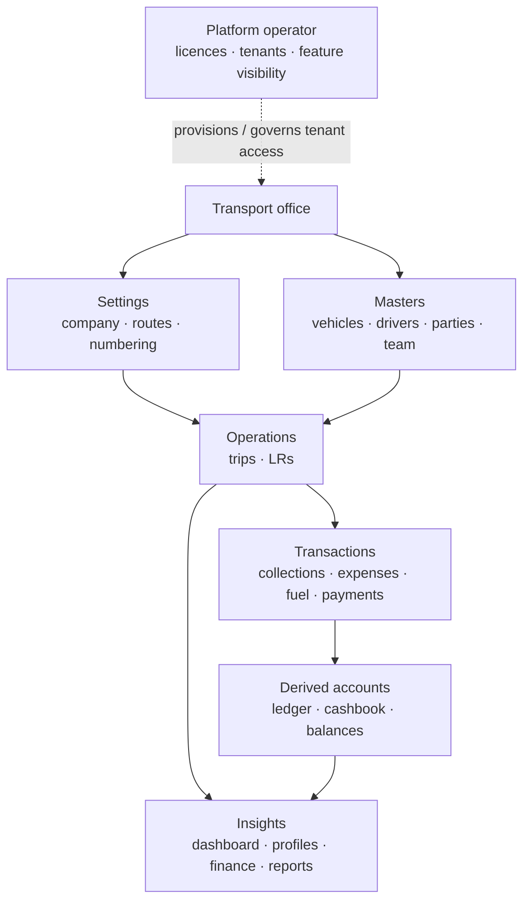

# Fleet Manager — architecture and design

This document records the architecture present in the repository. Update it with every feature or change that alters components, trust boundaries, API contracts, data ownership, persistence, external integrations, or user navigation. The diagrams describe the current system, not a target architecture.

## 1. System at a glance

Fleet Manager is a browser-based React single-page application, a Python FastAPI HTTP API, and MongoDB persistence. The API also writes upload bytes to local disk and can call Google Maps from the browser and WheelsEye from the backend when configured.

### Repository map

| Path | Responsibility |
|---|---|
| `backend/server.py` | FastAPI app, `/api` routes, request middleware, settings defaults, request orchestration, reporting and aggregation. |
| `backend/auth.py` | Password hashing/verification, JWT issue/verification, user seeding, authenticated-user lookup, platform-role dependency. |
| `backend/db.py` | MongoDB client and platform DB, tenant database naming/context, ID/date/serialization helpers. |
| `backend/ledger.py` | Ledger/cashbook postings, reversals, statements and derived balances. |
| `backend/storage.py` | Tenant-scoped local upload paths and file read/write helpers. |
| `backend/requirements.txt` | Python backend runtime dependencies. |
| `backend/tests/` | API-level multitenancy, auth, business-report and platform tests. They require a reachable configured API. |
| `frontend/src/App.js` | Login state, role-dependent routes and app shell composition. |
| `frontend/src/components/` | Shared layout, controls, forms, location picker and quick-entry UI. |
| `frontend/src/pages/` | Dashboard, business modules, profiles, login and platform console screens. |
| `frontend/src/lib/` | Axios API client, fetch/master hooks, formatting and exports. |
| `frontend/package.json` | React toolchain/dependencies and frontend package version. |
| `scripts/smoke.py` | Manual end-to-end smoke flow against a running backend. |
| `memory/PRD.md` | Product requirements/history and backlog; validate it against current code before treating backlog items as current behavior. |

## 2. Browser navigation and role design

`frontend/src/App.js` loads `/api/me` when a stored `fms_token` exists, then selects the route set by role. `Layout` provides the shared navigation, quick-entry actions, global search, branding, and logout. Business feature flags currently filter the visible navigation; platform users receive only the platform routes.

The frontend API client in `frontend/src/lib/api.js` uses `REACT_APP_BACKEND_URL` with `/api` appended, sends the stored token as a bearer credential, and clears it on a non-login 401 response. `useFetch` and `useMaster` in `frontend/src/lib/hooks.js` provide page-level read/reload behavior; pages call the API client for mutations.

## 3. Authentication and tenant request flow

The platform database is `<DB_NAME>_platform`. It stores `users`, `tenants`, and platform error logs. Each authenticated business request checks the associated licence is active and sets a `ContextVar` to the tenant's database name. The `db` proxy resolves subsequent business collection access against that context.

Authentication facts:

- Password hashes use bcrypt. JWTs use HS256 and the configured `JWT_SECRET`; the current token expiry is 30 days.
- `current_user` looks up the user and licence in the platform database and sets the tenant database for a business user.
- `/api/platform/...` routes use `require_super`, which rejects non-superadmin roles.
- `/api/health` is outside the `/api` router. Login and static file retrieval do not require `current_user`; review file exposure implications before changing upload behavior.
- The per-tenant feature map is merged in `/api/me` and used by the frontend shell; it is not a backend endpoint policy.

### Database placement

| Data | Database | Examples |
|---|---|---|
| Platform users, licences and platform errors | `<DB_NAME>_platform` | `users`, `tenants`, `error_logs` |
| Primary tenant's business data | `<DB_NAME>` | Tenant `naidu` maps to base database |
| Other tenants' business data | `<DB_NAME>_<tenant_id>` | Separate tenant collections; tenant IDs are generated from business/owner names with uniqueness suffixes |

Operational collections referenced by the code include `settings`, `trips`, `lrs`, `vehicles`, `drivers`, `team`, `parties`, `fuel_pumps`, `partners`, `receipts`, `handovers`, `expenses`, `fuel`, `payments`, `advances`, `tpl`, `ledger`, `cashbook`, and `files`. Keep collection ownership tenant-local unless a deliberate platform-wide dataset is designed and documented.

## 4. Business data and money flow

The backend records source documents (trip, LR, receipt, payment, expense, fuel, advance, handover, and 3PL entry) in their domain collections. Financial effects are posted through `backend/ledger.py`. Finance and dashboard endpoints aggregate those records to derive balances and totals.

Core accounting conventions in the implementation:

- `ledger`: debits increase a party receivable; credits decrease it. The same ledger supports driver, employee, fuel-pump, and partner balances with entity-specific meanings.
- `cashbook`: `account` is generally `cash`, `bank`, or `deewanji`; `direction` is `in` or `out`.
- A receipt posts a party credit and a cashbook inflow. A handover moves the amount out of Deewanji-held cash and into office cash/bank.
- Fuel on credit and payments affect payables; advances/repayments update person balances.
- Reversal uses `cancelled: true` flags against the source and linked financial postings. Do not hard-delete or manually edit derived balances.
- The UI displays INR and localized date formats; stored dates are generally ISO strings.

## 5. API surface by capability

All business API routes are mounted under `/api`. Most business reads/writes depend on `current_user`.

| Capability | Representative routes |
|---|---|
| Auth and profile | `POST /auth/login`, `GET /auth/me`, `GET /me` |
| Settings and masters | `/settings`, `/masters/{res}`, `/parties/suggest` |
| Trips and LRs | `/trips`, `/trips/{id}`, `/lrs`, `/lrs/{id}`, `/lr-stats` |
| Transactions | `/receipts`, `/handovers`, `/expenses`, `/fuel`, `/payments`, `/advances`, `/tpl`; cancel operations use `/{id}/cancel` |
| Ledger and entity profiles | `/ledger/{etype}/{eid}`, `/profile/{vehicle|driver|party|employee|fuel_pump|partner}/{id}` |
| Finance and dashboard | `/finance/{summary|receivables|payables|cashbook|charts}`, `/dashboard`, `/dashboard/monthly`, `/alerts` |
| Search, reports, documents | `/search`, `/reports/{name}`, `/upload`, `/files/{path}` |
| Tracking integration | `/tracking/live` (WheelsEye tokens are configured per vehicle) |
| Platform owner | `/platform/{summary|tenants|errors}`, `/platform/tenants`, `/platform/tenants/{id}`, `/platform/tenants/{id}/reset-password` |

`backend/server.py` currently owns route definitions and most orchestration. `auth.py`, `db.py`, `ledger.py`, and `storage.py` are the supporting modules. When extracting routes into routers or adding a new service, preserve the auth dependency, tenant context, financial posting/cancellation behavior, and tests.

## 6. Design and feature map

The intended interaction is an office workflow centered on a business owner: create or review a trip, create its LR, register financial events as they happen, then use the dashboard, profiles and reports to follow the resulting operational and financial state. The responsive shell supports desktop navigation and compact mobile navigation/quick actions.

### Frontend screens

- `Dashboard.jsx`: operating summary, alerts, collections/cash, and monthly charts.
- `Trips.jsx`, `TripForm.jsx`, `TripDetail.jsx`: trip list, entry, detail, cost/profit and status.
- `LRForm.jsx`, `LRView.jsx`: create/print/share freight documents.
- `Vehicles.jsx`, `VehicleDetail.jsx`: fleet list, records and profiles.
- `Parties.jsx`, `PartyDetail.jsx`: customer records, outstanding and ledger.
- `Team.jsx`, `PersonDetail.jsx`: driver/team workflows and balances.
- `Finance.jsx`: financial categories and entry flows.
- `Reports.jsx`: report selection, filters and exports.
- `Settings.jsx`: business configuration and branding.
- `Platform.jsx`: platform licence operations and platform settings.

Shared `components/ui.jsx`, `MasterForm.jsx`, and `QuickForms.jsx` provide common controls/forms. `LocationPicker.jsx` progressively enables map lookup if the optional Google Maps key is configured.

## 7. Runtime configuration and operational boundaries

- Backend reads `MONGO_URL`, `DB_NAME`, and `JWT_SECRET`, plus owner/platform seed credentials from `backend/.env`; use `.env.example` as the template and never commit real secrets.
- Frontend reads `REACT_APP_BACKEND_URL` and optionally `REACT_APP_GOOGLE_MAPS_API_KEY` from its environment.
- Local uploads are stored beneath `backend/data/uploads/`; that folder is ignored by Git.
- CORS is configured in `backend/server.py`. Review allowed origins and credentials together before production deployment.
- The startup handler seeds users/settings and creates a small set of MongoDB indexes.
- Middleware records server-side failures in the platform database; platform owners can inspect `/platform/errors`.
- There is no separate deployment/orchestration layer defined in the repository. README instructions describe local development, not a production deployment or backup/restore procedure.

## 8. Known gaps and architecture cautions

- The API is a large, single `server.py`; keep changes scoped, reuse established helpers, and consider route/module extraction only as a separately reviewed architecture change.
- Feature flags currently hide frontend navigation but are not uniformly checked at backend endpoints.
- Local disk uploads require persistent shared storage and backups if deployed beyond one local machine.
- External integrations require user-provided credentials and must have explicit timeout/error behavior.
- Test setup expects a live API and may use environment paths or ports that differ from this README's local defaults; inspect the fixtures before running tests.
- The in-repo PRD has historical statements and a backlog. Confirm actual behavior in source before extending documentation or promising features.

## 9. Architecture change record

For every architecture-affecting feature/change, add a dated note here stating the changed component/boundary, new data or API flow, compatibility/migration impact, and relevant verification. Keep the diagrams in Sections 1–6 synchronized in the same change set. The release/changelog entry lives in [VERSION.md](VERSION.md).

### v1.1.2 — 27 September 2026

- Recorded the current React → FastAPI → MongoDB architecture, authentication/tenant flow, financial posting model, navigation design, integrations, and known operational boundaries.
- This release documents the existing implementation; it does not introduce an application runtime or data-model change.
