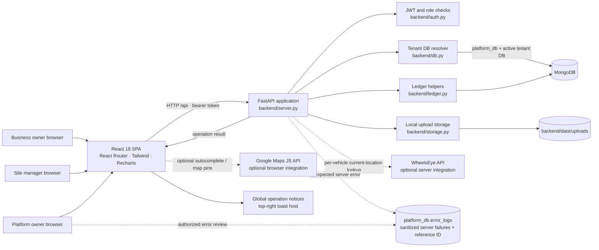
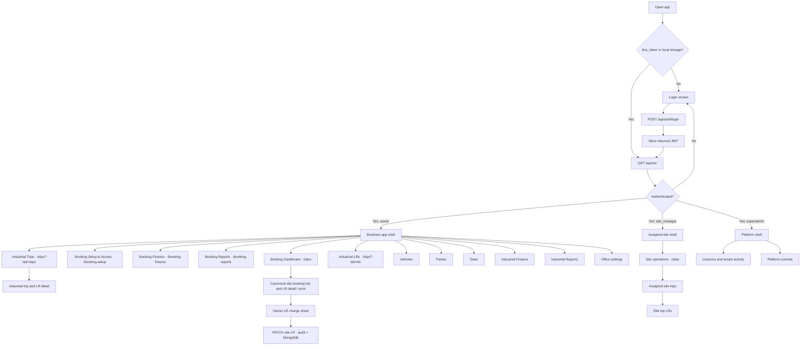
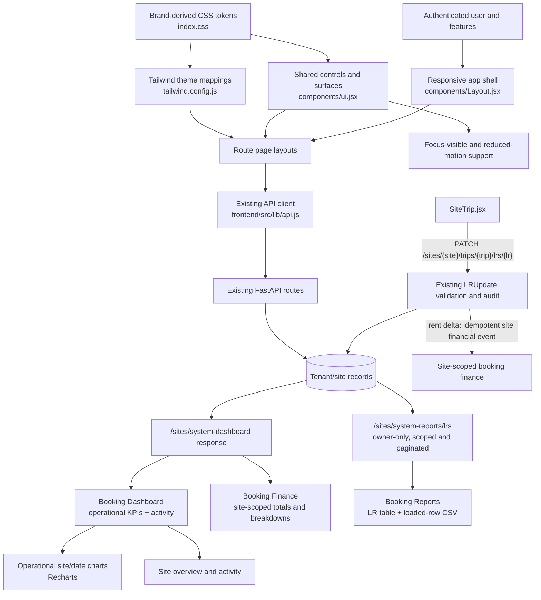
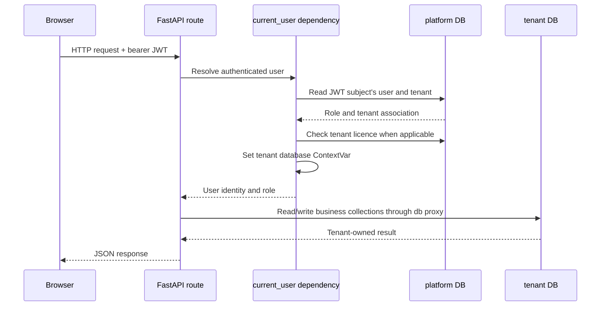
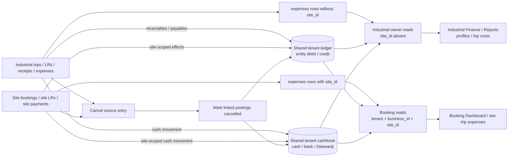
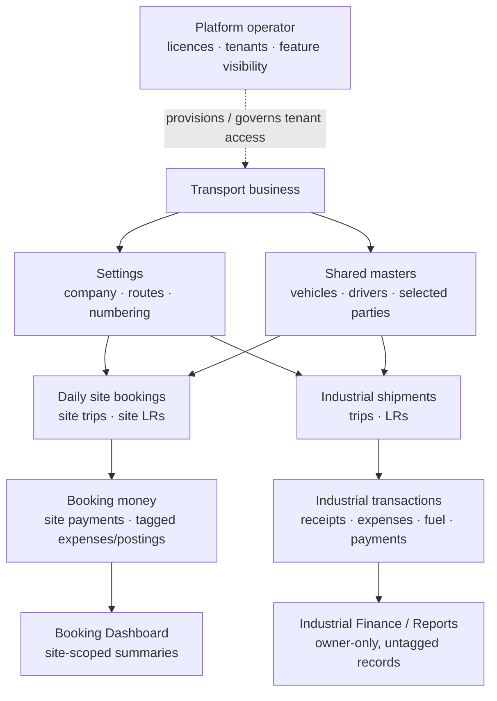
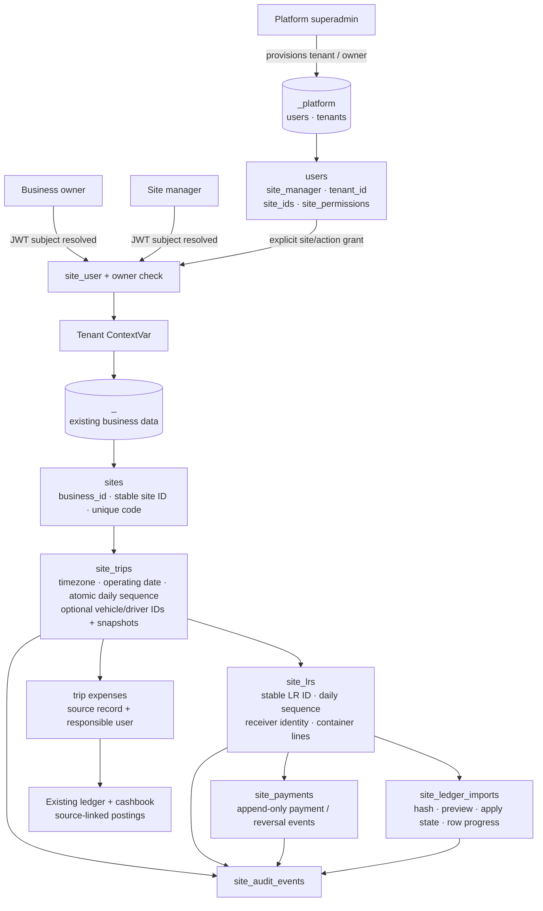
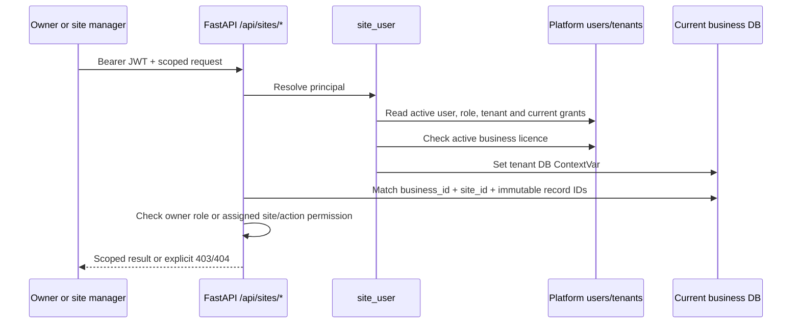
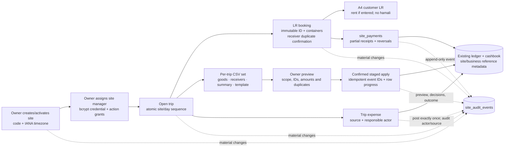

# Fleet Manager — architecture and design

This document records the architecture present in the repository. Update it with every feature or change that alters components, trust boundaries, API contracts, data ownership, persistence, external integrations, or user navigation. The diagrams describe the current system, not a target architecture.

## 1. System at a glance

Fleet Manager is a browser-based React single-page application, a Python FastAPI HTTP API, and MongoDB persistence. The API also writes upload bytes to local disk and can call Google Maps from the browser and WheelsEye from the backend when configured.

### Repository map

| Path | Responsibility |
|---|---|
| `backend/server.py` | FastAPI app, `/api` routes, request middleware, settings defaults, request orchestration, reporting and aggregation. |
| `backend/site_ops.py` | Additive multi-site API: owner/manager authorization, site/trip/LR operations, booking board data, trip expenses, payments, audit, migration, and staged ledger reconciliation. |
| `backend/auth.py` | Password hashing/verification, JWT issue/verification, user seeding, authenticated-user lookup, platform-role dependency. |
| `backend/db.py` | MongoDB client and platform DB, tenant database naming/context, ID/date/serialization helpers. |
| `backend/ledger.py` | Ledger/cashbook postings, reversals, statements and derived balances. |
| `backend/storage.py` | Tenant-scoped local upload paths and file read/write helpers. |
| `backend/requirements.txt` | Python backend runtime dependencies. |
| `backend/tests/` | API-level multitenancy, auth, business-report and platform tests. They require a reachable configured API. |
| `frontend/src/App.js` | Login state, role-dependent routes and app shell composition. |
| `frontend/src/components/` | Shared layout, controls, forms, location picker and quick-entry UI. |
| `frontend/src/pages/` | Dashboard, business modules, profiles, login, platform console, Bookings Window Board/site administration, trip/LR operations and print views. |
| `frontend/src/lib/` | Axios API client with operation feedback, fetch/master hooks, formatting and exports. |
| `frontend/package.json` | React toolchain/dependencies and frontend package version. |
| `scripts/smoke.py` | Manual end-to-end smoke flow against a running backend. |
| `memory/PRD.md` | Product requirements/history and backlog; validate it against current code before treating backlog items as current behavior. |

## 2. Browser navigation and role design

`frontend/src/App.js` loads `/api/me` when a stored `fms_token` exists, then selects the route set by role. `Layout` provides the shared navigation, quick-entry actions, global search, branding, and logout. Business feature flags currently filter the visible navigation; platform users receive only the platform routes. The owner has separate Booking Dashboard, Booking Setup & Access, Booking Finance/Reports, and Industrial Trips/LRs/Finance/Reports entry points. The operational Booking Dashboard no longer contains site setup, manager administration, or category editing. Site managers receive only their assigned site booking workspace; booking setup, financial/report views, and industrial routes are owner-only. Trips and LRs share `/trips` with a `tab` query parameter.

The frontend API client in `frontend/src/lib/api.js` uses `REACT_APP_BACKEND_URL` with `/api` appended, sends the stored token as a bearer credential, and clears it on a non-login 401 response. `useFetch` and `useMaster` in `frontend/src/lib/hooks.js` provide page-level read/reload behavior; pages call the API client for mutations.

Booking Dashboard and site trip/LR pages call site-scoped endpoints and display only canonical booking records. Industrial Trips, LRs, Finance and Reports use the owner-only business APIs and do not request site booking records. The former on-demand site panel and global industrial search/Quick Add controls are hidden on site booking routes to keep the operational domains distinct; this changes navigation only and does not migrate or duplicate records.

### Presentation architecture and design view (27 September 2026)

The visual foundation is shared across routes and uses the existing light palette. `frontend/src/index.css` defines CSS design tokens and common component/accessibility behavior; `frontend/tailwind.config.js` maps Tailwind theme colors and elevation to those tokens; `Layout.jsx` composes role-aware desktop/mobile navigation; shared controls live in `components/ui.jsx`. Page-specific layouts and their existing API clients remain responsible for workflows and data. `SiteConsole.jsx` serves the role-guarded operational dashboard at `/sites` and the owner-only setup/access view at `/booking-setup`; the latter handles site creation/editing, Team-profile selection/linkage, manager permissions and booking categories. The selected-site editor labels optional city and location values directly. The owner dashboard response includes a bounded, read-only daily trip/LR count series derived from the same site/date/trip filters as its totals.

Design implementation notes:

- The existing forest-green, amber and neutral colors are retained as CSS variables; this adds no dark theme or new palette.
- Depth is provided by restrained CSS elevation and layered surfaces. No WebGL/3D renderer or new runtime dependency is introduced.
- Booking Dashboard charts use site dashboard response values. Daily trip/LR counts and site totals follow the selected filters; financial summaries and collection/outstanding charts live on the separate Booking Finance page. `activity_by_date` is grouped by operating date and fills empty dates with zero counts for chart continuity.
- Booking Finance reads `/sites/system-dashboard`; Booking Reports reads the paginated, owner-only `/sites/system-reports/lrs` endpoint. Both remain within the existing site booking data family and never call industrial Finance/Reports endpoints.
- The owner LR charge sheet calls the existing `PATCH /sites/{site_id}/trips/{trip_id}/lrs/{lr_id}` update route. Amount validation, open-trip/reconciliation/payment guards, rent idempotency, audit history and Mongo persistence remain server-owned.
- The additive dashboard response field does not change authorization, stored data, financial calculations, or the separate canonical office and site trip/LR collections.
- Global reduced-motion styles honor `prefers-reduced-motion`; mobile layout and navigation are implemented in the shared shell.

## 3. Authentication and tenant request flow

The platform database is `<DB_NAME>_platform`. It stores `users`, `tenants`, and platform error logs. Each authenticated business request checks the associated licence is active and sets a `ContextVar` to the tenant's database name. The `db` proxy resolves subsequent business collection access against that context.

Authentication facts:

- Password hashes use bcrypt. JWTs use HS256 and the configured `JWT_SECRET`; the current token expiry is 30 days.
- Site-manager passwords are never recoverable from storage: owner assignment/reset requests store bcrypt hashes, and `/sites/managers` returns manager IDs, status and access grants without password fields. The owner UI holds a just-entered temporary password in component memory only long enough to copy it after assignment/reset; it does not persist that value, and the owner must reset the credential if it is lost.
- `current_user` looks up the principal and permits only the `owner` role for industrial business endpoints, then uses its tenant context.
- `site_user` resolves the principal for identity and site APIs; site routes enforce owner/site-manager role, tenant, site assignment and action scope. `/api/me` identity resolution remains available to site managers.
- `/api/platform/...` routes use `require_super`, which independently resolves and permits only `superadmin`; platform users do not receive tenant business API access.
- `/api/health` is outside the `/api` router. Login and static file retrieval do not require `current_user`; review file exposure implications before changing upload behavior.
- The per-tenant feature map is merged in `/api/me` and used by the frontend shell; it is not a backend endpoint policy.

### Database placement

| Data | Database | Examples |
|---|---|---|
| Platform users, licences and platform errors | `<DB_NAME>_platform` | `users`, `tenants`, `error_logs` |
| Primary tenant's business data | `<DB_NAME>` | Tenant `naidu` maps to base database |
| Other tenants' business data | `<DB_NAME>_<tenant_id>` | Separate tenant collections; tenant IDs are generated from business/owner names with uniqueness suffixes |

Operational collections referenced by the code include `settings`, `trips`, `lrs`, `vehicles`, `drivers`, `team`, `parties`, `fuel_pumps`, `partners`, `receipts`, `handovers`, `expenses`, `fuel`, `payments`, `advances`, `tpl`, `ledger`, `cashbook`, and `files`. Additive multi-site collections are `sites`, `site_trips`, `site_lrs`, `site_counters`, `site_receivers`, `site_categories`, `site_payments`, `site_financial_events`, `site_audit_events`, `site_ledger_imports`, and `site_migrations`. Site-manager identities remain in platform `users`, with a tenant ID, active flag, assigned `site_ids`, and per-site `site_permissions`. Keep collection ownership tenant-local unless a deliberate platform-wide dataset is designed and documented.

### Current data-flow audit (verified in routes and frontend callers)

- **Bookings / site operations:** `SiteConsole.jsx` calls `/sites/{site_id}/trips` and `/sites/{site_id}/trips/{trip_id}/lrs`. `site_ops.py` stores these in tenant-local `site_trips` and `site_lrs`; their identities, references and site authorization are distinct from legacy records.
- **Office Trips and LRs:** `TripForm.jsx`, `LRForm.jsx`, `TripDetail.jsx`, `LRView.jsx` and `Trips.jsx` call `/trips` and `/lrs`. `server.py` reads and writes tenant-local `trips` and `lrs`, and their legacy ledger/receipt behavior.
- **Finance and reports:** `/finance/*`, `/reports/*`, search and industrial profiles use legacy/industrial source collections. The shared `expenses`, `ledger` and `cashbook` collections can also contain site-tagged booking postings; industrial balances, statements, cash positions, expenses, trip costs, cashbook views and charts explicitly exclude records with `site_id`. Site dashboard/report paths use site-scoped booking records and tagged expense/posting data; there is no combined company-wide financial read model.
- **Shared masters:** Legacy and site trip resource selectors use the same tenant `vehicles` and `drivers` collections. Site trips retain the selected master IDs plus truck/driver snapshots. Site receiver identity is tracked in `site_receivers`; a related party may be created in shared `parties` with `site_receiver_id`, while legacy sender parties use the same collection without this site identity.
- **People and access:** Office staff/drivers use tenant `team`/`drivers`; site-manager login identities and grants live in platform `users`, scoped by tenant and explicit site permissions. A manager login may reference an Office Team document through `team_member_id`; this does not merge the authentication identity with the Team employee profile or copy credentials into the tenant database. The owner-only Booking Setup & Access register displays manager IDs/status/site assignments; only bcrypt hashes are stored, and temporary passwords are displayed in the browser only immediately after assignment/reset. Replacing a manager does not replace operational actor history.
- **Existing legacy-site migration:** `/sites/migration/legacy` only previews records missing `site_id`; its confirmed operation adds `site_id` and `business_id` to the legacy documents. It does not copy or transform `trips`/`lrs` into `site_trips`/`site_lrs`, build ID mappings, or migrate financial events.

Therefore each tenant database contains two active operational trip/LR models with deliberately separate UI and read paths. They are not separate MongoDB databases: operational records use distinct collections, while vehicles/drivers and selected masters are shared. Site financial postings in shared collections are tagged with `site_id`; industrial readers filter them out. No canonical-storage transition or migration is part of this release.

## 4. Business data and money flow

The backend records source documents (trip, LR, receipt, payment, expense, fuel, advance, handover, and 3PL entry) in their domain collections. Financial effects are posted through `backend/ledger.py`. Finance and dashboard endpoints aggregate those records to derive balances and totals.

Core accounting conventions in the implementation:

- `ledger`: debits increase a party receivable; credits decrease it. The same ledger supports driver, employee, fuel-pump, and partner balances with entity-specific meanings.
- `cashbook`: `account` is generally `cash`, `bank`, or `deewanji`; `direction` is `in` or `out`.
- A receipt posts a party credit and a cashbook inflow. A handover moves the amount out of Deewanji-held cash and into office cash/bank.
- Fuel on credit and payments affect payables; advances/repayments update person balances.
- Reversal uses `cancelled: true` flags against the source and linked financial postings. Do not hard-delete or manually edit derived balances.
- The UI displays INR and localized date formats; stored dates are generally ISO strings.

## 5. API surface by capability

All business API routes are mounted under `/api`. Most business reads/writes depend on `current_user`.

| Capability | Representative routes |
|---|---|
| Auth and profile | `POST /auth/login`, `GET /auth/me`, `GET /me` |
| Settings and masters | `/settings`, `/masters/{res}`, `/parties/suggest` |
| Industrial Trips and LRs (owner-only) | `/trips`, `/trips/{id}`, `/lrs`, `/lrs/{id}`, `/lr-stats` |
| Site booking operations (owner/site-scoped) | `/sites`, `/sites/{site_id}/trips`, `/sites/{site_id}/trips/{trip_id}/lrs`, and canonical site trip/LR detail routes |
| Transactions | `/receipts`, `/handovers`, `/expenses`, `/fuel`, `/payments`, `/advances`, `/tpl`; cancel operations use `/{id}/cancel` |
| Ledger and entity profiles | `/ledger/{etype}/{eid}`, `/profile/{vehicle|driver|party|employee|fuel_pump|partner}/{id}` |
| Industrial Finance and reports (owner-only) | `/finance/{summary|receivables|payables|cashbook|charts}`, `/reports/{name}`; shared financial reads exclude site-tagged rows |
| Booking dashboard (owner/site-scoped) | `/sites/system-dashboard`, `/sites/{site_id}/dashboard`; site-specific dates, payments and expenses |
| Booking reports (owner-only) | `/sites/system-reports/lrs`; tenant/site-scoped LR search, date filters and pagination |
| Booking LR charge edits (owner/site-scoped) | `PATCH /sites/{site_id}/trips/{trip_id}/lrs/{lr_id}`; audited canonical LR update |
| Search, reports, documents | `/search`, `/reports/{name}`, `/upload`, `/files/{path}` |
| Tracking integration | `/tracking/live` (WheelsEye tokens are configured per vehicle) |
| Platform owner | `/platform/{summary|tenants|errors}`, `/platform/tenants`, `/platform/tenants/{id}`, `/platform/tenants/{id}/reset-password` |

`backend/server.py` owns legacy routes and mounts the additive site router from `backend/site_ops.py`. `auth.py`, `db.py`, `ledger.py`, and `storage.py` are supporting modules. When extracting routes into routers or adding a new service, preserve the auth dependency, tenant context, financial posting/cancellation behavior, and tests.

## 6. Design and feature map

The intended interaction is an office workflow centered on a business owner: create or review a trip, create its LR, register financial events as they happen, then use the dashboard, profiles and reports to follow the resulting operational and financial state. The responsive shell supports desktop navigation and compact mobile navigation/quick actions.

### Frontend screens

- `SiteConsole.jsx`: focused Booking Dashboard, site administration and operational booking context.
- `BookingFinance.jsx`: owner-only booking financial summary from site dashboard aggregations; no industrial ledger data.
- `BookingReports.jsx`: owner-only paginated site-LR report with bounded filters and loaded-row CSV export.
- `SiteTrip.jsx`: canonical site-trip detail and owner LR charge sheet using the existing site-LR update API.
- `Trips.jsx`, `TripForm.jsx`, `TripDetail.jsx`: owner-only industrial trip list, entry, detail, cost/profit and status.
- `LRForm.jsx`, `LRView.jsx`: owner-only industrial LR create/print/share workflows.
- `Vehicles.jsx`, `VehicleDetail.jsx`: fleet list, records and profiles.
- `Parties.jsx`, `PartyDetail.jsx`: customer records, outstanding and ledger.
- `Team.jsx`, `PersonDetail.jsx`: driver/team workflows and balances.
- `Finance.jsx`: owner-only industrial financial categories and entry flows; excludes site-tagged shared ledger/cashbook/expense records.
- `Reports.jsx`: owner-only industrial report selection, filters and exports; does not aggregate site bookings.
- `Settings.jsx`: business configuration and branding.
- `Platform.jsx`: platform licence operations and platform settings.
- `SiteTrip.jsx`: site trip lifecycle, LR booking, per-trip CSVs and staged ledger import.
- `SiteLRPage.jsx`: editable LR details, customer print view and authorized payment events.

Shared `components/ui.jsx`, `MasterForm.jsx`, and `QuickForms.jsx` provide common controls/forms. `LocationPicker.jsx` progressively enables map lookup if the optional Google Maps key is configured.

## 7. Runtime configuration and operational boundaries

- Backend reads `MONGO_URL`, `DB_NAME`, and `JWT_SECRET`, plus owner/platform seed credentials from `backend/.env`; use `.env.example` as the template and never commit real secrets.
- Frontend reads `REACT_APP_BACKEND_URL` and optionally `REACT_APP_GOOGLE_MAPS_API_KEY` from its environment.
- Local uploads are stored beneath `backend/data/uploads/`; that folder is ignored by Git.
- CORS is configured in `backend/server.py`. Review allowed origins and credentials together before production deployment.
- The startup handler seeds users/settings and creates a small set of MongoDB indexes.
- Middleware records server-side failures in the platform database; platform owners can inspect `/platform/errors`.
- There is no separate deployment/orchestration layer defined in the repository. README instructions describe local development, not a production deployment or backup/restore procedure.

## 8. Known gaps and architecture cautions

- The API is a large, single `server.py`; keep changes scoped, reuse established helpers, and consider route/module extraction only as a separately reviewed architecture change.
- Feature flags currently hide frontend navigation but are not uniformly checked at backend endpoints.
- Local disk uploads require persistent shared storage and backups if deployed beyond one local machine.
- External integrations require user-provided credentials and must have explicit timeout/error behavior.
- Test setup expects a live API and may use environment paths or ports that differ from this README's local defaults; inspect the fixtures before running tests.
- The in-repo PRD has historical statements and a backlog. Confirm actual behavior in source before extending documentation or promising features.

## 9. Architecture change record

For every architecture-affecting feature/change, add a dated note here stating the changed component/boundary, new data or API flow, compatibility/migration impact, and relevant verification. Keep the diagrams in Sections 1–6 synchronized in the same change set. The release/changelog entry lives in [VERSION.md](VERSION.md).

### v1.1.2 — 27 September 2026

- Recorded the current React → FastAPI → MongoDB architecture, authentication/tenant flow, financial posting model, navigation design, integrations, and known operational boundaries.
- This release documents the existing implementation; it does not introduce an application runtime or data-model change.

## 10. Multi-site transport architecture (v1.2.0)

The multi-site feature extends, rather than replaces, the existing database-per-business tenancy model. It does not introduce a second database or rewrite legacy trip/LR collections. Owner site APIs use `site_user` plus owner-role checks; manager APIs additionally verify tenant, active site assignment, and per-site action permissions on every request. Legacy business APIs continue to use `current_user`, which denies the `site_manager` role. Managers receive no site access unless assigned or explicitly granted by the owner.

### Data and relationship diagram

### Authorization request flow

### Trip, LR, ledger and money flow

Trip and LR counters use atomic MongoDB increments with unique compound indexes. Trip references are `<SITE><DDMMYYYY>-<NN>`; LR references are `<SITE>LR<DDMMYYYY>-<NN>`. MongoDB IDs remain stable relationships; truck numbers and display labels are attributes, not keys.

### API, money and reconciliation boundaries

- The site router mounted by `server.py` exposes site/manager administration, the Bookings Window Board summaries, authorized tenant vehicle/driver choice data, trip lifecycle and expenses, categories, LR CRUD, payments/reversals, audit history, explicit legacy migration, CSV exports, and import upload/preview/edit/commit/original-download.
- Site queries include authenticated business/site scope at the service/database layer. Manager grants default to no cross-site access. Business-wide dashboards, manager administration, ledger import/export, and legacy migration are owner-only.
- New currency values use `Decimal` in application logic and MongoDB `Decimal128`. The existing `ledger.py` interface accepts floats for postings, so site finance calls the existing helper with optional site/business metadata; balances use Decimal-safe LR and payment records, not browser totals.
- Site trip expenses follow the existing ledger/cashbook source-posting conventions. Preserve tenant/site/trip references and the authenticated recorder on each expense; idempotent source references prevent duplicate posting on retries. Trip liability/accountability is tied to the recorded responsible person and must not be inferred solely from an editable driver label.
- Rent adjustments post deltas through the existing party ledger. Actual payments and owner reversals are separate immutable `site_payments` events linked to LR/trip/site/business. Hamali is a separate recorded charge and is not posted as collected bhada or classified as a cost.
- Ledger interchange uses versioned, scoped CSV files with immutable `lr_id`, `trip_id`, and `site_id` fields. Because CSV has no worksheets, goods-wise, receiver-wise, summary, and import-template files are separate downloads. The parser validates the whole file before preview; the owner resolves row errors, acknowledges missing LRs, and confirms. Imports are file-hash idempotent. Deterministic row events and persisted progress support resuming when multi-document MongoDB transactions are unavailable.
- Report CSVs use a header-first layout with explicit scope and units; the goods summary and per-LR/container goods-detail report serve different grains. Detailed rows do not repeat LR-level monetary totals per container. The versioned import-template alone is accepted for reconciliation; its headers, metadata, and paid-total semantics remain stable.
- Successful/failed frontend mutations use a shared Axios feedback path and top-right toast host. Unexpected backend exceptions receive a reference ID and a sanitized platform error-log entry; do not persist bearer tokens, request bodies, passwords, or other secrets in the log.
- Original ledger files use the private `fleet-manager/<business>/site-ledgers/` path. The unauthenticated legacy file handler rejects this path; an owner-checked API serves originals. The underlying local filesystem storage is not shared durable production storage.

### Migration and indexing

Legacy preview reports records lacking a site assignment in selected tenant-local collections. The owner creates a default site and explicitly confirms migration. Apply fills `site_id` and `business_id` only when `site_id` is missing/null, stores counts and audit metadata, and can repeat/resume without reassigning already-scoped records. It does not silently choose or create a site.

Indexes cover unique business/site codes; unique site/day trip and LR sequences/references; receiver/date lookups; business/site/trip LR and payment access; payment idempotency and reversal keys; category uniqueness; audit/import timelines; and unique site financial posting references. `initialize_site_storage()` creates tenant-local indexes once per active database and for newly licensed tenants.

Configuration change in v1.2.0: `tzdata>=2025.2,<2027` provides IANA timezone data on Windows hosts.

### Known limitations

- Existing businesses need an owner-created default site before previewing and explicitly applying legacy site assignment.
- CSV is the supported interchange format; no XLSX writer or multi-sheet workbook is implemented.
- Hamali accounting meaning is unconfirmed; it remains separate from collected bhada, profit and cash flow.
- Original ledger files use the existing local storage provider; production needs private, durable, shared storage and backup/retention controls.
- No live MongoDB integration suite was run for this change in this environment. Offline unit tests and frontend production build are the executed checks; production multi-worker/transaction behavior needs deployment verification.

### v1.2.0 — 27 September 2026

- Added the site/business data and authorization boundaries, manager grants, trip/LR lifecycle, staged ledger/payment flow, migration rules, and deployment limitations described above.

### v1.2.1 — 27 September 2026

- Kept `site_payment_reversal_unique` as a unique sparse index, matching existing tenant DB index metadata so startup can safely reuse it.
- Rejected invalid payment-balance events are explicitly marked and excluded from dashboard/payment aggregates. Owners can retry pending idempotent ledger/cashbook postings; reversals also resume safely after interrupted requests.

### v1.2.2 — 27 September 2026

- Fixed the site document serializer to retain each top-level MongoDB `_id` as API `id`, while continuing to omit nested internal IDs. This restores site listing and dashboard responses.
- Added tenant-scoped trip resource lookup for vehicle/driver selectors; site trip records retain optional source master IDs and immutable truck/driver snapshots, with manual entry supported.
- Added an opt-in destructive-by-design (writes-only) API acceptance test; it is disabled unless pointed explicitly at a disposable test service.

### v1.3.0 — 27 September 2026

- Reframed the owner `/sites` screen as the Bookings Window Board and added site/trip/LR and receiver-/goods-wise outstanding views; added mobile-focused trip/LR screens and optional LR contact phones.
- Added source-linked, idempotently posted site trip expenses using the existing ledger/cashbook conventions, with actor attribution, audit history, and trip/site totals.
- Added immediate LR print navigation through the browser print flow, retaining repeat printing and PDF saving.
- Added operation-specific mutation toasts and reference-linked platform error logging for unexpected server failures and failed writes. Error logs omit request bodies/headers/query strings and redact sensitive fields; login failures and failed reads are not persisted as write errors.
- Reworked report CSVs to use clear headers/scope/units and provide detailed goods/container rows. The existing immutable-ID import template format remains the only accepted reconciliation input. Validation: focused offline tests and frontend build; no live API/MongoDB workflow run.

### v1.3.1 — 27 September 2026

- Changed the site-trip expense idempotency index declaration to match the named partial index already present in deployed tenant databases. This repairs the reported startup failure without dropping/rebuilding the index or changing records.
- Split route page code into lazy-loaded frontend chunks; avoid duplicate Board request cycles and avoid loading legacy trip masters/settings on the LR tab. The compiled application now emits a small entry bundle plus route chunks instead of placing every page in the entry chunk.
- Scoped legacy `/trips` LR, expense, and fuel summary aggregations to the IDs in the requested trip page. Empty pages skip all related aggregation; supporting `trip_id` indexes allow bounded matching. Existing cancellation and financial-total semantics are unchanged.
- Offline tests cover the query filters, totals, empty-page path, index specification, and page-size limits. No live MongoDB latency benchmark was run; production p50/p95 and query plans still need measurement with representative tenant data.
- No storage migration, database reset, or data deletion is required. The existing tenant-per-database boundary and collection schemas are retained.

### v1.4.0 — 27 September 2026

- Added an owner-only, collapsed Site bookings panel to Trips & LR. It loads site lists, paginated trips and trip-scoped LRs on demand through the existing site APIs, and links to their canonical detail/print routes.
- Kept site and office records in their original tenant collections and financial workflows. The owner view does not copy records, mirror mutations, or create duplicate ledger/payment effects; site authorization remains enforced by the existing API.
- Made Booking Dashboard the owner landing/sidebar entry. Its compact KPI row includes filtered trip/LR and financial totals plus active trips and pending reconciliation; quick actions lead into the booking, LR, finance and report workflows. The former `/dashboard` browser route redirects to `/sites`.
- Added a `total_trips` field to the existing filtered site-dashboard aggregation; it is computed from the same matched site trips as the selected date/site/trip/status/receiver filters.
- Grouped detailed dashboard analytics and site/manager/category administration into collapsed sections. Existing site/office collections and financial flows are not unified by this view redesign.
- No API schema or data migration is required. Frontend tests cover lazy loading and canonical trip/LR navigation; live database latency is deployment-specific and was not benchmarked.

### v1.7.0 — 27 September 2026

- Added separate owner-only Booking Finance and Booking Reports screens and a tenant/site-scoped paginated LR report API. The dashboard is now operationally focused; detailed financial breakdowns are available in Booking Finance.
- Added the owner LR charge sheet on site-trip detail. Bhada/hamali edits call the existing canonical LR update route, preserving server validation, audit and financial idempotency.
- No booking records were moved, mirrored or newly stored. Site and industrial finance/report sources remain separate.

### v1.6.0 — 27 September 2026

- Removed the site-bookings panel and cross-workflow quick links from industrial Trips/LRs; hid global industrial search and Quick Add controls while on site booking routes. Booking Dashboard/site trip/LR screens and owner-only industrial Trips/LRs/Finance/Reports now have separate navigation and data paths.
- Tightened `current_user` to business owners only; `site_user` continues resolving owner/site-manager identity for `/api/me` and site-scoped routes, while `require_super` independently enforces platform access.
- Site booking expenses and ledger/cashbook postings remain in their existing tenant collections with `site_id`. Industrial read models explicitly match rows where `site_id` is absent; industrial expense cancellation also verifies the source row is unscoped before reversing postings.
- No database, collection, API schema or record migration is introduced. Shared vehicle/driver/master data and existing canonical trip/LR collections remain unchanged.
- Verification: focused offline backend authorization, financial-scope and site-operations tests passed (51); frontend tests passed (15 across 6 suites); production build completed. No live/write-enabled workflow was run because the available local API was not confirmed to belong to this project or a disposable tenant.
